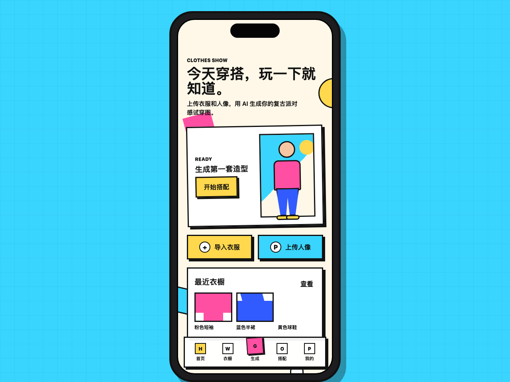
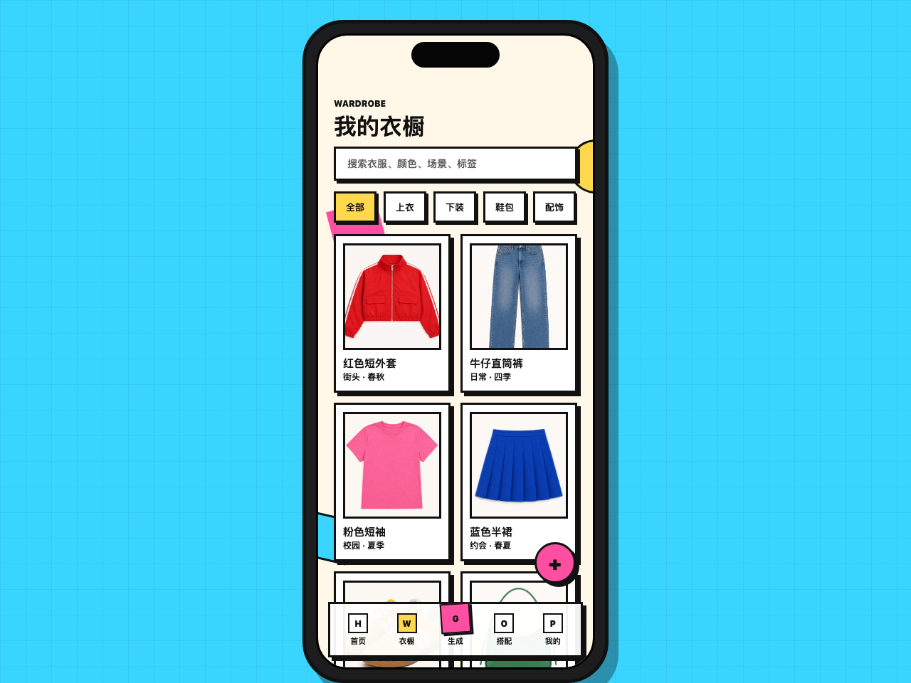
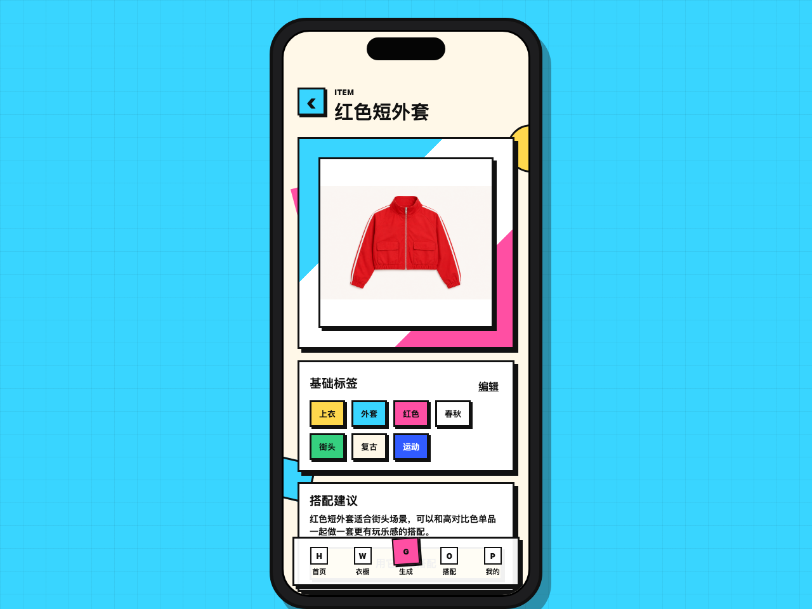

# Clothes Show

English | [中文说明](README.zh-CN.md)

Clothes Show is an iOS-first digital wardrobe and AI outfit reference prototype.

The current version is a static frontend prototype focused on validating the wardrobe management and clothing import flow.

## Screenshots







## Current Features

- iPhone Pro-style mobile mockup.
- Memphis 1980s geometric visual direction.
- Clothing import flow.
- Image crop and white-background simulation.
- Wardrobe primary category filtering.
- Wardrobe search.
- Clothing detail page.
- Multi-tag display and custom tag editing.
- Realistic clothing reference assets.

## Run Locally

From the project root:

```bash
python3 -m http.server 5188
```

Then open:

```text
http://localhost:5188
```

## Project Structure

```text
.
├── index.html
├── styles.css
├── app.js
├── assets/
│   └── clothes/
├── PLAN.md
├── DESIGN_DIRECTION.md
├── IOS_APP_SCOPE.md
└── WIREFRAMES.md
```

## Current Status

This is not a production iOS app yet. It is a static prototype used to validate product flows, UI direction, and wardrobe interactions before choosing SwiftUI, React Native, or another iOS-compatible implementation stack.

## Next Directions

- Connect a real backend and image storage.
- Add real background removal.
- Connect the outfit generator to real wardrobe items.
- Add portrait profiles and AI outfit reference generation.
- Persist search, filters, tags, and import records.
